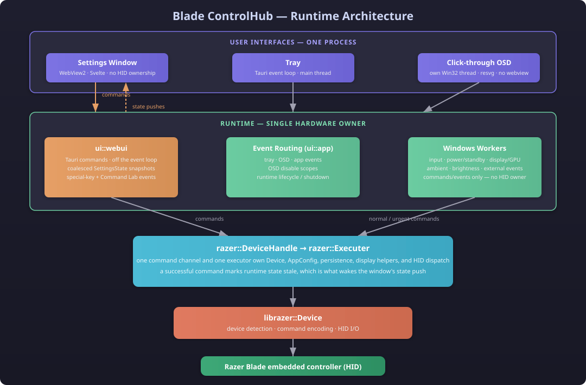

# Blade ControlHub

A lightweight, native Windows application for Razer Blade laptops that provides granular hardware control via direct HID communication — no proprietary drivers or Razer Synapse required.


## Features

### New features
* **Razer Key Mappings:** Uses keyhooks to allow defaulting $F1 - F12$ keys to multimedia actions, with support for secondary "Razer Hyperboost" functions via the $Fn$ key.
* **Ambient Keyboard Lighting Effect:** Dynamically matches the keyboard backlight to the dominant color on your screen.
* **Adaptive OSD:** Modern, aesthetic design with smooth fade animations. Built on a reusable architecture that supports multiple SVG icons, text labels, and precise indicator levels.
* **Power Profiles:** Automatically switches settings based on your power state (**On Battery** vs. **AC Power**).


### Razer Device Controls
| Category | Controls (SHIFT to cycle backwards) |
|---|---|
| **Performance Mode** | Silent, Quiet, Balanced, Performance, Turbo, Custom |
| **RGB Lighting** | Cycle, Wave, Breathe, Ambient, Starlight, Reactive |
| **Battery Limit** | Off, 50%, 55%, 60%, 65%, 70%, 75%, 80% |
| **Display** | Screen brightness, refresh rate |
| **Keyboard** | Backlight intensity, Function/Multimedia key toggle |
| **Key Mapping** | Custom remapping of Razer special keys (macro-style) |
| **Power Profiles** | Separate settings for plugged-in and battery modes |
| **GPU Mode** | GPU CLI utilities |

## Supported Devices

| Model | VID:PID | Support |
|---|---|---|
| Razer Blade 18 (2025) | `1570:02C7` | Fully supported |
| Razer Blade 14 (2021/2022) | `1570:1016` | WIP |
| Razer Blade 15/17 (2021) | `1570:1043` | WIP |
| Razer Blade 14 (2024) | `1570:1044` | WIP |
| Razer Blade 15/17 (2023) | `1570:1045` | WIP |
| Razer Blade 16 (2024) | `1570:1046` | WIP |
| Razer Blade 14 (2025) | `1570:1047` | WIP |
| Razer Blade 16 (2025) | `1570:1048` | WIP |
| Razer Blade 14 (2024 V2) | `1570:1049` | WIP |

## Architecture



The main runtime is the sole owner of hardware access. It hosts the tray, OSD,
keyboard and Windows monitors, runtime settings snapshot, and local named-pipe
IPC server. The settings window is a separate egui client: it reads the runtime
snapshot and sends explicit commands over IPC; it never opens a HID device or
persists configuration itself.

- **UI:** the tray and click-through OSD run in the main runtime; the settings
  client communicates through `ipc::{client,server,protocol}`.
- **Hardware:** `razer::DeviceHandle` serializes normal and urgent commands to
  the single `razer::Executer`, which owns `librazer::Device`, config updates,
  and persistence.
- **Windows services:** input hooks, power/standby, display/GPU, external
  monitor, brightness, and ambient workers publish commands or events without
  becoming additional HID owners.
- **State:** `runtime::SettingsState` is an IPC-friendly runtime snapshot;
  persisted `AppConfig` keeps AC and battery profiles while device-backed state
  is queried by the executor.

## Hardware Control

Blade ControlHub communicates directly with the Razer Blade's embedded controller via HID protocol.

Core device control via locally vendored `librazer` (derived from [razer-ctl](https://github.com/tdakhran/razer-ctl))

## Configuration

Settings are persisted to disk as JSON. The configuration supports **dual power profiles**:

- **Power State** — Settings applied when the laptop is plugged in
- **Battery State** — Settings applied when running on battery

Each profile independently controls: keyboard backlight level, RGB effect, backlight intensity, screen brightness, refresh rate, and performance mode.

## Building

```bash
cargo build --release
```

The binary is produced at `target/release/blade-controlhub.exe`.

## Usage

```bash
# Normal start (shows initialization notification)
blade-controlhub.exe

# Silent start (no startup notification)
blade-controlhub.exe --silent
```

The application enforces single-instance operation — launching a second instance will close the new one.

## License

MIT
